# GitHub 个人主页卡片

一个动态、自动更新的 GitHub 个人主页 SVG 卡片，展示你的项目、编程语言、贡献统计等信息。

**[English](README_EN.md)**

<div align="center">
  
</div>

## 功能特性

- **编程语言星轨** — 自动检测你使用最多的 12 种编程语言，以行星轨道方式环绕太阳展示
- **项目列表** — 展示所有仓库，包含描述、语言和最后更新日期
- **活动面板** — 显示贡献数、仓库数、关注者和连续贡献进度
- **贡献蛇形图** — 动画蛇形路径展示你的贡献日历
- **自动更新** — 每 6 小时通过 GitHub Actions 自动刷新

## 快速开始

### 第一步：Fork 本仓库

点击右上角 **Fork** 按钮，将本仓库 Fork 到你的账号下。

> Fork 后会自动使用你的 GitHub 用户名、仓库、语言等数据，无需修改任何代码。

### 第二步：设置 Personal Access Token（可选）

如果你想在卡片中显示**私有仓库**，需要设置 PAT。只显示公开仓库可跳过此步。

1. 前往 [GitHub Settings → Developer settings → Personal access tokens → Fine-grained tokens](https://github.com/settings/tokens?type=beta)
2. 点击 **Generate new token**
3. 填写 Token name（随意，如 `profile-card`）
4. Expiration 选择 **No expiration** 或你需要的有效期
5. Repository access 选择 **Only select repositories**，选中你要展示的仓库（或选 **All repositories**）
6. 在 **Permissions → Repository permissions** 中，将 **Metadata** 设为 **Read**
7. 点击 **Generate token**，复制生成的 token

然后回到你 Fork 的仓库：

1. 进入仓库 **Settings → Secrets and variables → Actions**
2. 点击 **New repository secret**
3. Name 填 `PAT`
4. Secret 填上一步复制的 token
5. 点击 **Add secret**

### 第三步：启用 Actions 并运行

1. 前往你 Fork 后仓库的 **Actions** 页面
2. 如果看到 "I understand my workflows, go ahead and enable them"，点击启用
3. 点击左侧 **update profiles**，再点击 **Run workflow → Run workflow**
4. 等待约 15 秒运行完成，`profile-card.svg` 就生成好了！

### 第四步：更新你的 README

将你的同名仓库的 `README.md` 替换为：

```markdown
<div align="center">
  
</div>
```

## 自定义

### 修改配色主题

默认使用粉色/紫色/青色配色。在 workflow 中搜索替换以下颜色：

| 颜色 | 用途 |
|------|------|
| `#FF69B4` | 主色粉色 |
| `#D4A5FF` | 副色紫色 |
| `#00D4FF` | 点缀青色 |
| `#00ff88` | 成功绿色 |
| `#0a0a1a` | 背景色 |

### 修改更新频率

编辑 workflow 中的 `cron` 行：

```yaml
on:
  schedule:
    - cron: "23 */6 * * *"  # 每 6 小时的第 23 分钟
```

### 添加自定义语言图标

编辑 workflow 中的 `LANG_MAP` 对象：

```javascript
'YourLang': { abbr: 'YL', color: '#FF0000', textColor: '#fff' },
```

## 工作原理

1. **GitHub Actions** 按计划运行（每 6 小时）或手动触发
2. 通过 GitHub API 获取你的仓库、语言、贡献和关注者数据
3. 生成包含以下内容的 SVG：
   - 基于你实际语言的动态编程语言星轨
   - 仓库项目列表
   - 真实统计数据面板
   - 贡献日历蛇形图
4. 将更新后的 SVG 提交到仓库

## 常见问题

**Q: 为什么看不到私有仓库？**
A: 需要按上述第二步设置 Personal Access Token (PAT)。

**Q: 可以去掉星轨部分吗？**
A: 可以，删除 workflow 中的 `arsenalSection` 部分并调整高度计算即可。

**Q: SVG 显示的是旧版本？**
A: GitHub 会缓存 SVG 文件。在 README 的图片 URL 后添加 `?v=时间戳`，或等待几分钟。
